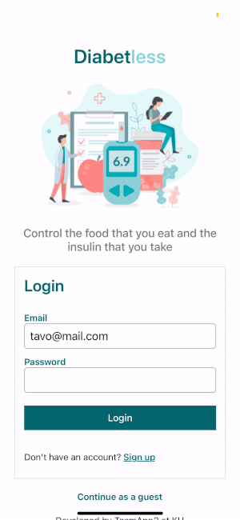

# Diabetes Mobile App

### Project description

A mobile application for diabetic type 1 users to keep a record of the food and the inlusin they take.

##### Live version
https://expo.io/@gustavozapata/projects/diabetes-app  
Scan the QR code with your phone and make sure expo app is installed

### Tech Stack

- JavaScript
- React Native
- Node.js
- Express.js
- MongoDB
- Expo CLI

### Client app

#### Depencencies

- React Navigation - To create routing and navigation for the app
- React Native Calendars - To display calendar views and populate them with data
- Axios - To make requests to the server
- Async Storage - Persistent storage

#### Installation
Create a file named 'local.js' with a single line `export const host = "http://<IP_ADDRESS>:4000`  
Make sure you add the IP address of your computer.  
Then:
- cd client
- npm install
- npm start

### Server app

#### Dependencies

- Express - Nodejs framework
- Mongoose - MongoDB framework
- Cors - Enables CROSS-origin resource sharing
- Dotenv - Accessing environment variables

#### Installation
DB_URI is an environment variable used by the server.js file. DB_URI needs to be replaced by your MongoDB database URI.  
Make sure you create a file .env and add the URI in here: DB_URI=your-db-uri  
Then:
- cd server
- npm install
- npm start

### APIs

- Edamam Food API - https://developer.edamam.com/

#### Created by Gustavo Zapata and James Newton